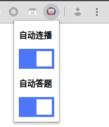

## SEU Mooc Helper

> 🤖 一个用来帮助你学习 Mooc 的小助手

### Features

* 屏蔽了对于鼠标的检测，让你可以在课余生活中后台播放 Mooc，有效的增加学习强度
* 自动连播，可以 24 小时不间断的学习课程，提高学习质量
* 自动回答弹出来的题目，可以让播放更流畅，防止干扰我们的听课思路

### How to Use

1. 下载这个插件包
2. 打开 chrome://extensions/
3. 允许 Developer Mode
4. 选择 Load upacked
5. 打开选课页面
6. 点击 "下载 .ics 日历文件"
7. 导入到任意日历应用 (Google calendar 等)
8. Star 这个项目

### Screenshots

### Know Issues

* 系统可能会弹出验证码，但是频率很低，基本可以无视

### 免责声明

本插件目的是让大家更好的学习精品课程，请勿用到非法的地方。如产生任何问题，本人概不负责。
